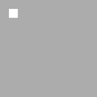

# 地图生成

对于下图所示任意11*11的迷宫:

白色为路点 `road_point`, 玩家 可以移动; 灰色为墙点 `wall_point`, 玩家不可移动到上面.

0. **初始化**  
   定义一个全部为 `wall` 的迷宫以开始生成(如下图).  
     
   定义两个容器 `roads` `walls`.  
   将起点 `(1, 1)` 加入容器 `walls`.

1. 从 `walls` 中取出一元素 `point1` (此时 `walls` 中不存在此元素), 在迷宫里将其标记为 `road`.  
   ***当 `walls` 中仅有起点 `(1, 1)` 时的迷宫:***  
   

2. 在 `point1` 四周随机选择一个存在于 `roads` 中的点: `point2`, 并将其与 `point1` 打通.  
   当四周没有符合条件的点则跳过本步骤.  
   ***一种可能的情况(红色为 `point1`, 蓝色为被选中的 `point2`):***  
     
   ***打通后:***  
   

3. 将 `point1` 加入 `roads`.

4. 将 `point1` 四周相距两格且不在 `walls` 中的 `wall` 加入 `walls`.

重复上述 **1~4** 操作, 直到 `walls` 为空.